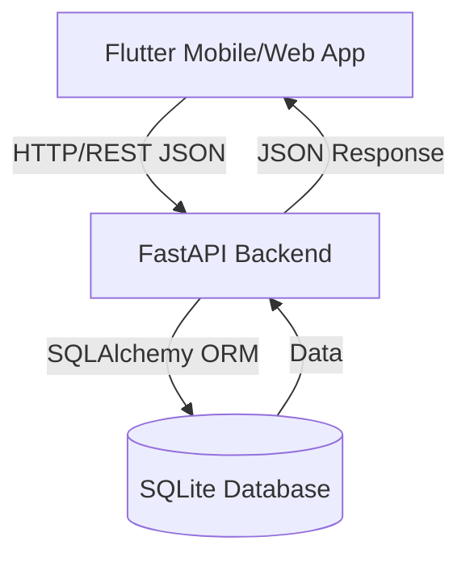
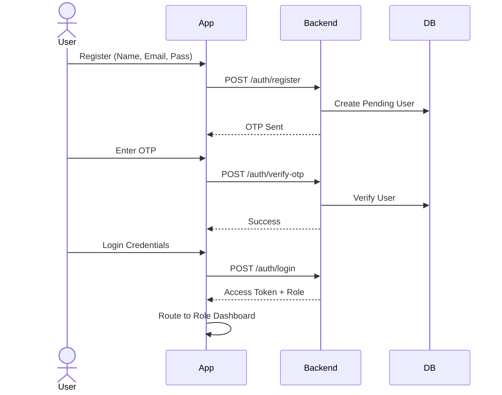
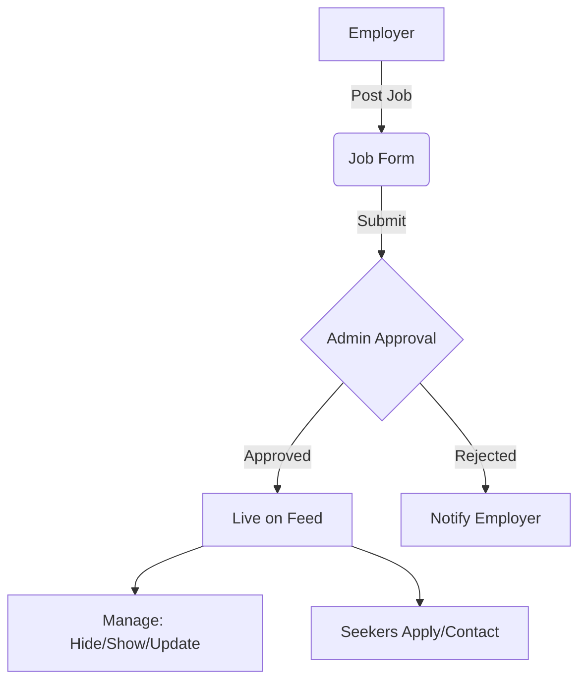
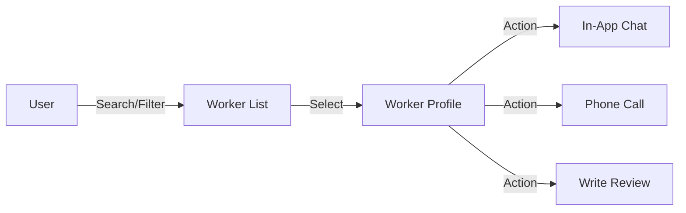

# Jobsify Skilled Labour Service Platform

Jobsify is a comprehensive Flutter + FastAPI platform designed to connect job seekers, employers, skilled workers, and administrators in a unified, workflow-driven ecosystem.

## Overview

Jobsify facilitates local skilled labour discovery and hiring by bridging the gap between:

- **General Users**: Authenticated users who access a unified dashboard with two core modules:
  - **Browse Jobs**: To search for employment opportunities.
  - **Find Workers**: To search for and contact skilled professionals.
- **Administrators**: Specialized accounts (triggered by specific credentials) that access the Admin Dashboard to manage users, content, and platform safety.

The application features secure authentication, real-time-like messaging, geolocation-based discovery, and a robust moderation system.

## System Architecture



## Product Workflows

### 1. User Registration and Login



### 2. Job Creation & Management (Employer)



### 3. Worker Discovery & Contact



## Features

### 🔐 Authentication & Security
- **Secure Signup**: Email registration with OTP verification.
- **Password Reset**: Secure forgot-password flow with OTP.
- **Input Normalization**: Auto-capitalization for names and lowercase enforcement for emails.
- **Strong Validation**: Enforced password complexity and form validation.
- **Role-Based Access**: Distinct logic for Users, Workers, and Admins.
- **Session Management**: Persistent login states.

### 💼 Jobs Ecosystem
- **Posting**: Employers can create jobs with urgency, salary, and location.
- **Management**: Job owners can hide/show jobs and update worker requirements.
- **Discovery**: Advanced filtering by category, location, urgency, and salary.
- **Interaction**: Save jobs, one-tap calling, and Google Maps integration.
- **Safety**: Report mechanism for suspicious posts.

### 🛠️ Skilled Worker Platform
- **Profiles**: Detailed worker profiles with experience and ratings.
- **Availability**: Workers can toggle their online/offline status.
- **Reviews**: Users can rate, review, edit, and delete their reviews.

### 💬 Messaging System
- **Inbox**: Centralized chat interface.
- **Real-time Interaction**: Polling-based messaging for reliability.
- **Notifications**: Unread message counts and alerts.

### 🛡️ Admin Dashboard
- **Stats**: Platform usage overview.
- **Moderation**: Approve or reject jobs and worker profiles.
- **User Management**: Handle reports and block abusive users.

## Tech Stack

### Frontend
- **Framework**: Flutter (Dart)
- **Networking**: `http`, `connectivity_plus`
- **State/Storage**: `shared_preferences`
- **Utilities**: `url_launcher`, `geolocator`, `intl`, `permission_handler`

### Backend
- **Framework**: FastAPI (Python)
- **Database**: SQLite (SQLAlchemy)
- **Validation**: Pydantic
- **Server**: Uvicorn

## Project Structure

```bash
jobsify/
├── lib/
│   ├── main.dart             # App Entry Point
│   ├── models/               # Data Models
│   ├── screens/              # UI Screens
│   │   ├── auth/             # Login & Register
│   │   ├── home/             # Main Dashboard
│   │   ├── jobs/             # Job Feeds & Details
│   │   ├── workers/          # Worker Directory
│   │   ├── messages/         # Chat & Inbox
│   │   ├── profile/          # User Profiles
│   │   └── admin/            # Admin Panel
│   ├── services/             # API & Logic Layers
│   ├── utils/                # Constants & Helpers
│   └── widgets/              # Reusable Components
└── README.md

jobsify_backend/
├── app/
│   ├── main.py               # API Entry Point
│   ├── routers/              # Endpoint Logic
│   ├── models/               # DB Models
│   └── schemas/              # Pydantic Schemas
└── jobsify.db                # SQLite Database
```

## API Modules

### Auth

- `/auth/register`
- `/auth/verify-otp`
- `/auth/login`
- `/auth/me`
- `/auth/refresh`
- `/auth/logout`

### Jobs

- `/jobs`
- `/jobs/{job_id}`
- `/jobs/my`
- `/jobs/saved`
- `/jobs/report`
- `/jobs/save`

### Workers

- `/workers`
- `/workers/{worker_id}`
- `/workers/my`
- `/workers/report`

### Reviews

- `/reviews`
- `/reviews/worker/{worker_id}`
- `/reviews/my`

### Notifications

- `/notifications`

### Messages

- `/messages/conversations`
- `/messages/conversations/{conversation_id}`
- `/messages/conversations/{conversation_id}/read`
- `/messages/unread-count`

### Admin

- `/admin/stats`
- `/admin/users`
- `/jobs/admin/pending`
- `/workers/admin/pending`
- moderation and report actions

## Setup

## Backend Setup

```powershell
cd C:\Users\Adithyan T T\jobsify_backend
python -m venv venv
venv\Scripts\activate
pip install -r requirements.txt
venv\Scripts\python.exe -m uvicorn app.main:app --host 0.0.0.0 --port 8000
```

Backend docs:

```text
http://127.0.0.1:8000/docs
```

## Frontend Setup

```powershell
cd C:\Users\Adithyan T T\jobsify
flutter pub get
```

### Run on Chrome

```bash
flutter run -d chrome
```

### Run on Android emulator

Use `10.0.2.2` to reach the API running on your computer from the emulator:

```powershell
flutter run -d emulator-5554 --dart-define=API_BASE_URL=http://10.0.2.2:8000
```

### Run on Phone

Use your laptop Wi-Fi IPv4 address:

```powershell
flutter run --dart-define=API_BASE_URL=http://YOUR_WIFI_IP:8000
```

Example:

```powershell
flutter run --dart-define=API_BASE_URL=http://10.253.86.105:8000
```

## Testing

### Backend Tests

```powershell
cd C:\Users\Adithyan T T\jobsify_backend
venv\Scripts\python.exe -m pytest .\tests -q
```

### Flutter Analysis

```powershell
cd C:\Users\Adithyan T T\jobsify
flutter analyze
```

## Current Functional Areas

- authentication works (Login, Register, Forgot Password, OTP)
- comprehensive form validation (Auth, Jobs, Workers)
- job posting and browsing work
- worker posting and browsing work
- worker availability and reviews work (including edit/delete)
- notifications work
- messaging system works
- admin approval flow works

## Branding and UI Direction

The app now follows a more consistent moderate-blue visual direction to better match a professional service platform:

- less bright red emphasis
- cleaner cards and rounded controls
- consistent blue primary actions
- unified Jobsify branding across entry screens

## Notes

- Worker and job creation still depend on admin approval where applicable.
- Messaging uses a polling-based approach for reliability on the current stack.
- For physical-device testing, backend and phone must be on the same Wi-Fi network.

## Recommended Next Improvements

- remove remaining analyzer warnings across older screens
- convert deprecated radio APIs to modern Flutter patterns
- add screenshots to this README
- add websocket-based realtime chat
- add CI automation for backend and Flutter validation
