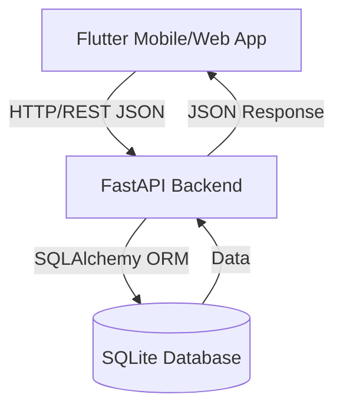
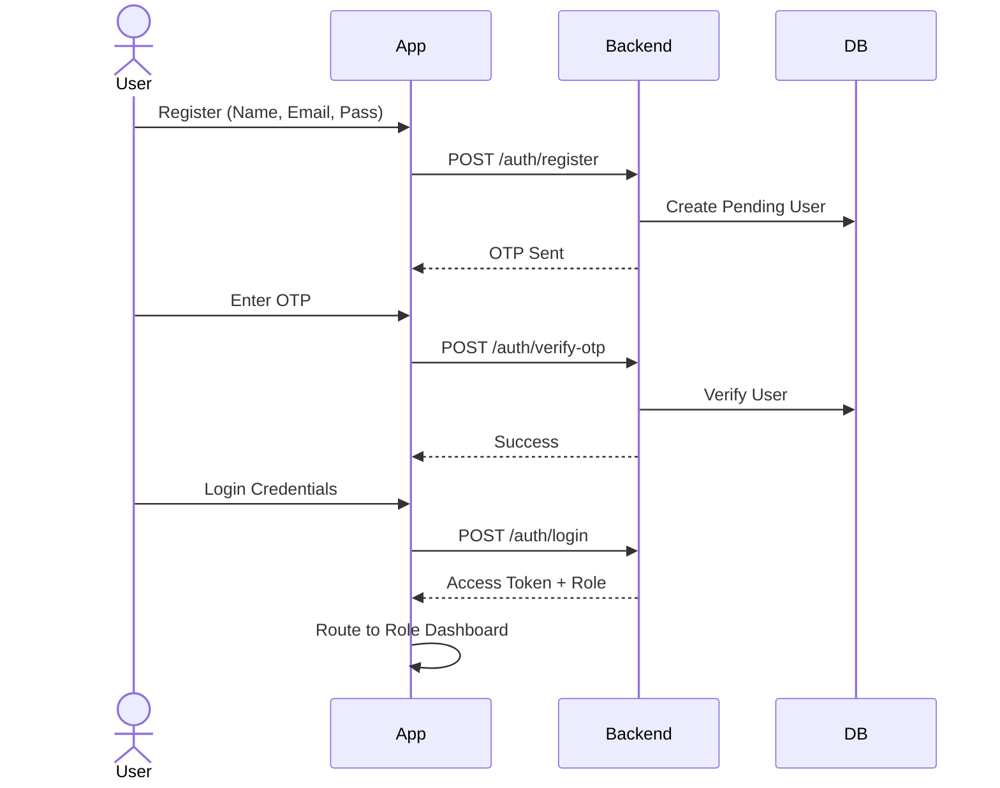
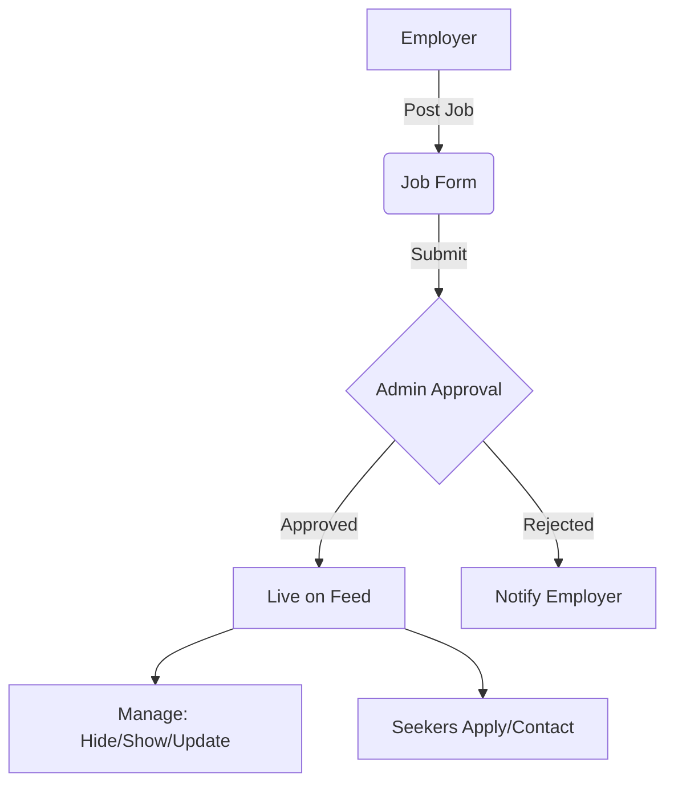
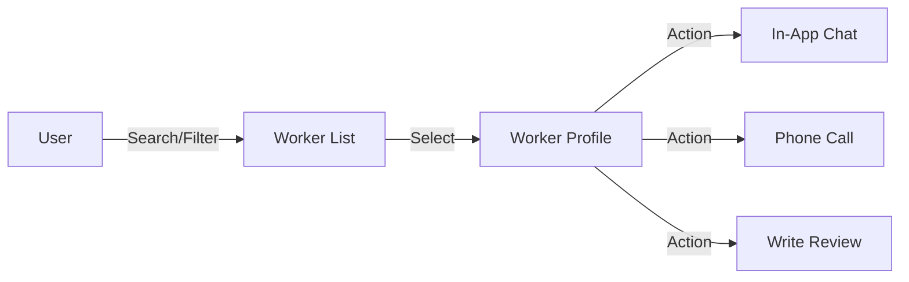

# Jobsify Skilled Labour Service Platform

Jobsify is a comprehensive Flutter + FastAPI platform designed to connect job seekers, employers, skilled workers, and administrators in a unified, workflow-driven ecosystem.

## Overview

Jobsify facilitates local skilled labour discovery and hiring by bridging the gap between:

- **General Users**: Authenticated users who access a unified dashboard with two core modules:
  - **Browse Jobs**: To search for employment opportunities.
  - **Find Workers**: To search for and contact skilled professionals.
- **Administrators**: Specialized accounts (triggered by specific credentials) that access the Admin Dashboard to manage users, content, and platform safety.

The application features secure authentication, real-time-like messaging, geolocation-based discovery, and a robust moderation system.

## Recent Updates (Post-Cleanup)

- **Workspace Cleaned**: Removed legacy TODO files, test artifacts, build dirs. `flutter analyze` passes cleanly.
- **Backend Enhancements**: Added logging/exception middleware, rate-limiting, optimized DB indices (verified/available jobs/workers), job vacancies logic (`required_workers - hired_count`).
- **Flutter SDK**: Confirmed compatible with ^3.10.1.
- **Core Flows Stable**: Auth (OTP/reset), jobs/workers CRUD (post/browse/manage/verify), reviews (edit/delete), messaging (polling), notifications, admin moderation.

## System Architecture



## Product Workflows

### 1. User Registration and Login



### 2. Job Creation & Management (Employer)



### 3. Worker Discovery & Contact



## Features

### 🔐 Authentication & Security
- **Secure Signup**: Email registration with OTP verification.
- **Password Reset**: Secure forgot-password flow with OTP.
- **Input Normalization**: Auto-capitalization for names and lowercase enforcement for emails.
- **Strong Validation**: Enforced password complexity and form validation.
- **Role-Based Access**: Distinct logic for Users, Workers, and Admins.
- **Session Management**: Persistent login states.

### 💼 Jobs Ecosystem
- **Posting**: Employers can create jobs with urgency, salary, and location.
- **Management**: Job owners can hide/show jobs and update worker requirements.
- **Discovery**: Advanced filtering by category, location, urgency, and salary.
- **Interaction**: Save jobs, one-tap calling, and Google Maps integration.
- **Safety**: Report mechanism for suspicious posts.
- **Vacancies**: Dynamic calculation (required_workers - hired_count).

### 🛠️ Skilled Worker Platform
- **Profiles**: Detailed worker profiles with experience and ratings.
- **Availability**: Workers can toggle their online/offline status.
- **Reviews**: Users can rate, review, edit, and delete their reviews.

### 💬 Messaging System
- **Inbox**: Centralized chat interface.
- **Real-time Interaction**: Polling-based messaging for reliability.
- **Notifications**: Unread message counts and alerts.

### 🛡️ Admin Dashboard
- **Stats**: Platform usage overview.
- **Moderation**: Approve or reject jobs and worker profiles.
- **User Management**: Handle reports and block abusive users.

## Tech Stack

### Frontend
- **Framework**: Flutter (Dart, SDK ^3.10.1)
- **Networking**: `http`, `connectivity_plus`
- **State/Storage**: `shared_preferences`
- **Utilities**: `url_launcher`, `geolocator`, `intl`, `permission_handler`

### Backend
- **Framework**: FastAPI (Python)
- **Database**: SQLite (SQLAlchemy)
- **Validation**: Pydantic
- **Middleware**: Logging, Exception Handling, Rate Limiting
- **Server**: Uvicorn

## Project Structure

```
jobsify/ (Flutter Frontend)
├── lib/
│   ├── main.dart             # App Entry Point
│   ├── models/               # Data Models
│   ├── screens/              # UI Screens (auth, home, jobs, workers, admin)
│   ├── services/             # API & Logic Layers
│   ├── utils/                # Constants & Helpers
│   └── widgets/              # Reusable Components
└── pubspec.yaml

jobsify_backend/ (FastAPI Backend)
├── app/
│   ├── main.py               # API Entry Point
│   ├── routers/              # Endpoint Logic (auth, jobs, workers...)
│   ├── models/               # DB Models (Job, Worker, User...)
│   ├── schemas/              # Pydantic Schemas
│   └── middleware/           # Logging/Exceptions
└── jobsify.db                # SQLite Database
```

## API Modules

- **Auth**: `/auth/register`, `/auth/verify-otp`, `/auth/login`, `/auth/me`, `/auth/forgot-password/...`
- **Jobs**: `/jobs`, `/jobs/{id}`, `/jobs/my`, `/jobs/saved`, `/jobs/report`
- **Workers**: `/workers`, `/workers/{id}`, `/workers/my`, `/workers/report`
- **Reviews**: `/reviews`, `/reviews/worker/{id}`
- **Notifications**: `/notifications`
- **Messages**: `/messages/conversations`, `/messages/unread-count`
- **Admin**: `/admin/stats`, `/admin/users`, `/jobs/admin/pending`, etc.

## Setup

### Backend Setup

```powershell
cd ../jobsify_backend
python -m venv venv
venv\Scripts\activate
pip install -r requirements.txt
venv\Scripts\python.exe -m uvicorn app.main:app --host 0.0.0.0 --port 8000 --reload
```

Backend docs: http://127.0.0.1:8000/docs

### Frontend Setup

```powershell
flutter pub get
```

### Run on Chrome

```bash
flutter run -d chrome --dart-define=API_BASE_URL=http://127.0.0.1:8000
```

### Run on Physical Device (Same WiFi)

```powershell
# Replace with your laptop's WiFi IPv4 (ipconfig)
flutter run --dart-define=API_BASE_URL=http://YOUR_WIFI_IP:8000
```

**Production Tip**: Admin access via predefined emails in auth_service.dart. Ensure backend binds to network IP.

## Testing

### Backend

```powershell
cd ../jobsify_backend
venv\Scripts\python.exe -m pytest tests/ -v
```

### Frontend

```powershell
flutter analyze
flutter test
```

## Screenshots

Add platform screenshots here:

- 
- 
- 
- 
- 

## Production Deployment Notes

- **Backend**: Dockerize FastAPI + SQLite → PostgreSQL migration recommended. Deploy on Railway/Vercel/Heroku.
- **Frontend**: `flutter build web` for hosting, or APK/IPA for stores.
- **Scaling**: Add Redis for sessions/notifications, WebSockets for realtime chat.

## Current Status

All core features functional and tested. Workspace optimized, analyzer clean. Ready for screenshots, CI/CD, and deployment!


